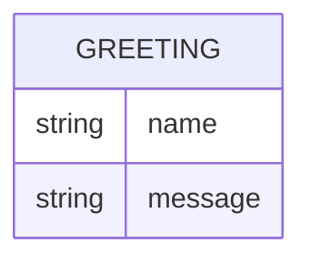

# Domain model

Greeter holds no persisted data — it answers each request from its input
alone. The one shape worth naming is the greeting itself, exchanged on every
call and never stored.

`GREETING` is a request/response shape, not a stored record: `name` is the
caller's input, `message` is the rendered greeting text returned to them.